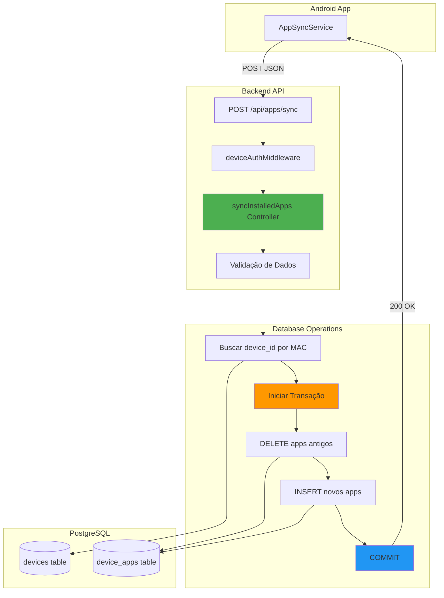
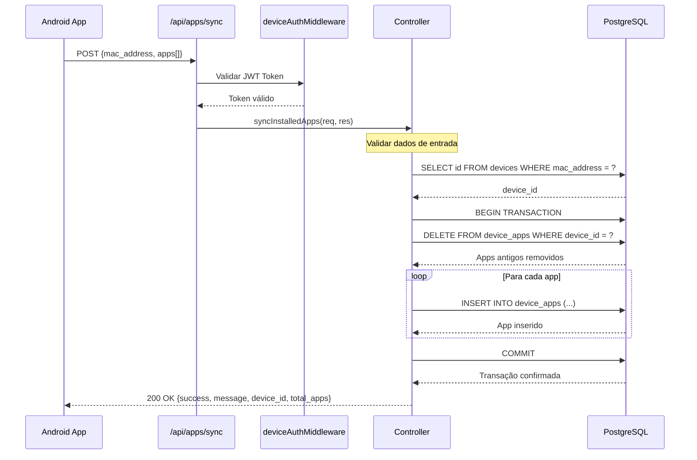

# Design Document: Backend Apps Sync Endpoint

## Overview

Este documento descreve o design técnico do endpoint `/api/apps/sync` no backend MaxxControl X para receber e armazenar listas completas de apps instalados enviadas pelos dispositivos Android. A solução implementa sincronização atômica usando transações PostgreSQL, garantindo consistência de dados e performance otimizada.

### Objetivos

- Criar endpoint REST que aceita lista completa de apps em uma requisição
- Implementar sincronização atômica usando transações PostgreSQL
- Garantir validação robusta de dados de entrada
- Fornecer logging detalhado para monitoramento
- Integrar-se perfeitamente com arquitetura existente do projeto

### Escopo

**Incluído:**
- Endpoint POST /api/apps/sync em appsController.js
- Rota com deviceAuthMiddleware em appsRoutes.js
- Validação de dados de entrada
- Busca de dispositivo por MAC address
- Transação PostgreSQL para atomicidade
- Limpeza de apps antigos + inserção de novos
- Resposta de sucesso com detalhes
- Logging completo
- Tratamento de erros

**Não Incluído:**
- Modificações no app Android
- Modificações no painel web
- Otimizações avançadas (bulk insert único)
- Versionamento de dados

## Architecture

### Visão Geral da Arquitetura



### Fluxo de Dados



## Components and Interfaces

### 1. Controller Function (appsController.js)

```javascript
/**
 * Sincroniza lista completa de apps instalados no dispositivo
 * Usa transação para garantir atomicidade
 * 
 * @route POST /api/apps/sync
 * @middleware deviceAuthMiddleware
 * @param {Object} req.body.mac_address - MAC address do dispositivo
 * @param {Array} req.body.apps - Lista de apps instalados
 * @returns {Object} 200 - {success, message, device_id, total_apps}
 * @returns {Object} 400 - {error} Dados inválidos
 * @returns {Object} 404 - {error} Dispositivo não encontrado
 * @returns {Object} 500 - {error} Erro no servidor
 */
exports.syncInstalledApps = async (req, res) => {
  const { mac_address, apps } = req.body;

  try {
    // 1. Validação de entrada
    if (!mac_address || !apps || !Array.isArray(apps) || apps.length === 0) {
      return res.status(400).json({ 
        error: 'MAC address e lista de apps são obrigatórios' 
      });
    }

    console.log(`🔄 Sincronizando ${apps.length} apps do dispositivo ${mac_address}...`);
    
    // 2. Buscar device_id pelo MAC
    const deviceResult = await pool.query(
      'SELECT id FROM devices WHERE mac_address = $1',
      [mac_address]
    );
    
    if (deviceResult.rows.length === 0) {
      console.log(`❌ Dispositivo não encontrado: ${mac_address}`);
      return res.status(404).json({ error: 'Dispositivo não encontrado' });
    }
    
    const device_id = deviceResult.rows[0].id;
    console.log(`✅ Device ID encontrado: ${device_id}`);
    
    // 3. Iniciar transação
    const client = await pool.connect();
    
    try {
      await client.query('BEGIN');
      
      // 4. Limpar apps antigos
      const deleteResult = await client.query(
        'DELETE FROM device_apps WHERE device_id = $1',
        [device_id]
      );
      console.log(`🗑️ ${deleteResult.rowCount} apps antigos removidos`);
      
      // 5. Inserir novos apps
      let insertedCount = 0;
      for (const app of apps) {
        // Validar campos obrigatórios
        if (!app.package_name || !app.app_name || 
            app.version_code === undefined || !app.version_name) {
          throw new Error(`App inválido: ${JSON.stringify(app)}`);
        }
        
        await client.query(
          `INSERT INTO device_apps 
           (device_id, package_name, app_name, version_code, version_name, is_system, installed_at)
           VALUES ($1, $2, $3, $4, $5, $6, NOW())`,
          [
            device_id,
            app.package_name,
            app.app_name,
            app.version_code,
            app.version_name,
            app.is_system || false
          ]
        );
        insertedCount++;
      }
      
      // 6. Commit da transação
      await client.query('COMMIT');
      console.log(`✅ ${insertedCount} apps sincronizados com sucesso`);
      
      // 7. Resposta de sucesso
      res.json({ 
        success: true,
        message: `${insertedCount} apps sincronizados`,
        device_id: device_id,
        total_apps: insertedCount
      });
      
    } catch (error) {
      // Rollback em caso de erro
      await client.query('ROLLBACK');
      throw error;
    } finally {
      // Sempre liberar client
      client.release();
    }
    
  } catch (error) {
    console.error('❌ Erro ao sincronizar apps:', error);
    res.status(500).json({ error: 'Erro ao sincronizar apps' });
  }
};
```

### 2. Route Definition (appsRoutes.js)

```javascript
// Adicionar no arquivo modules/apps/appsRoutes.js

const express = require('express');
const router = express.Router();
const appsController = require('./appsController');
const authMiddleware = require('../../middlewares/auth');
const deviceAuthMiddleware = require('../../middlewares/deviceAuth');

// ... rotas existentes ...

// Sincronizar lista completa de apps (do app Android)
router.post('/sync', deviceAuthMiddleware, appsController.syncInstalledApps);

module.exports = router;
```

## Data Models

### Request Body

```typescript
interface SyncAppsRequest {
  mac_address: string;  // Ex: "9C:00:D3:21:E0:3B"
  apps: AppData[];      // Lista de apps instalados
}

interface AppData {
  package_name: string;   // Ex: "com.netflix.mediaclient"
  app_name: string;       // Ex: "Netflix"
  version_code: number;   // Ex: 123456
  version_name: string;   // Ex: "8.95.0"
  is_system: boolean;     // true = sistema, false = usuário
}
```

### Response Body (Success)

```typescript
interface SyncAppsResponse {
  success: true;
  message: string;        // Ex: "25 apps sincronizados"
  device_id: number;      // Ex: 1
  total_apps: number;     // Ex: 25
}
```

### Response Body (Error)

```typescript
interface ErrorResponse {
  error: string;  // Mensagem de erro descritiva
}
```

### Database Schema

```sql
-- Tabela devices (já existe)
CREATE TABLE devices (
  id SERIAL PRIMARY KEY,
  mac_address VARCHAR(17) UNIQUE NOT NULL,
  -- outros campos...
);

-- Tabela device_apps (já existe)
CREATE TABLE device_apps (
  id SERIAL PRIMARY KEY,
  device_id INTEGER REFERENCES devices(id) ON DELETE CASCADE,
  package_name VARCHAR(255) NOT NULL,
  app_name VARCHAR(255) NOT NULL,
  version_code INTEGER NOT NULL,
  version_name VARCHAR(50) NOT NULL,
  is_system BOOLEAN DEFAULT false,
  installed_at TIMESTAMP DEFAULT NOW(),
  updated_at TIMESTAMP DEFAULT NOW(),
  UNIQUE(device_id, package_name)
);
```

## Error Handling

### Estratégia de Tratamento de Erros

#### 1. Validação de Entrada (400 Bad Request)

```javascript
// Validar presença de campos obrigatórios
if (!mac_address || !apps || !Array.isArray(apps) || apps.length === 0) {
  return res.status(400).json({ 
    error: 'MAC address e lista de apps são obrigatórios' 
  });
}

// Validar cada app individualmente
for (const app of apps) {
  if (!app.package_name || !app.app_name || 
      app.version_code === undefined || !app.version_name) {
    throw new Error(`App inválido: ${JSON.stringify(app)}`);
  }
}
```

#### 2. Dispositivo Não Encontrado (404 Not Found)

```javascript
if (deviceResult.rows.length === 0) {
  console.log(`❌ Dispositivo não encontrado: ${mac_address}`);
  return res.status(404).json({ error: 'Dispositivo não encontrado' });
}
```

#### 3. Erro de Transação (500 Internal Server Error)

```javascript
try {
  await client.query('BEGIN');
  // ... operações ...
  await client.query('COMMIT');
} catch (error) {
  await client.query('ROLLBACK');
  console.error('❌ Erro na transação:', error);
  throw error;
} finally {
  client.release();
}
```

#### 4. Erro Geral (500 Internal Server Error)

```javascript
catch (error) {
  console.error('❌ Erro ao sincronizar apps:', error);
  res.status(500).json({ error: 'Erro ao sincronizar apps' });
}
```

### Matriz de Erros

| Cenário | Status | Resposta | Ação |
|---------|--------|----------|------|
| MAC address ausente | 400 | `{error: "MAC address e lista de apps são obrigatórios"}` | Retornar erro |
| Apps array vazio | 400 | `{error: "MAC address e lista de apps são obrigatórios"}` | Retornar erro |
| App com campo faltando | 500 | `{error: "Erro ao sincronizar apps"}` | Rollback + log |
| Dispositivo não existe | 404 | `{error: "Dispositivo não encontrado"}` | Retornar erro |
| Erro no DELETE | 500 | `{error: "Erro ao sincronizar apps"}` | Rollback + log |
| Erro no INSERT | 500 | `{error: "Erro ao sincronizar apps"}` | Rollback + log |
| Erro de conexão DB | 500 | `{error: "Erro ao sincronizar apps"}` | Log + retornar erro |

## Testing Strategy

### 1. Testes Unitários

```javascript
describe('syncInstalledApps Controller', () => {
  
  test('deve retornar 400 se mac_address estiver ausente', async () => {
    const req = { body: { apps: [] } };
    const res = { status: jest.fn().mockReturnThis(), json: jest.fn() };
    
    await appsController.syncInstalledApps(req, res);
    
    expect(res.status).toHaveBeenCalledWith(400);
    expect(res.json).toHaveBeenCalledWith({ 
      error: 'MAC address e lista de apps são obrigatórios' 
    });
  });
  
  test('deve retornar 404 se dispositivo não for encontrado', async () => {
    // Mock pool.query para retornar vazio
    pool.query = jest.fn().mockResolvedValue({ rows: [] });
    
    const req = { body: { mac_address: 'AA:BB:CC:DD:EE:FF', apps: [{}] } };
    const res = { status: jest.fn().mockReturnThis(), json: jest.fn() };
    
    await appsController.syncInstalledApps(req, res);
    
    expect(res.status).toHaveBeenCalledWith(404);
  });
  
  test('deve sincronizar apps com sucesso', async () => {
    // Mock pool.query e client
    const mockClient = {
      query: jest.fn().mockResolvedValue({ rowCount: 5 }),
      release: jest.fn()
    };
    pool.connect = jest.fn().mockResolvedValue(mockClient);
    pool.query = jest.fn().mockResolvedValue({ rows: [{ id: 1 }] });
    
    const req = { 
      body: { 
        mac_address: '9C:00:D3:21:E0:3B', 
        apps: [
          {
            package_name: 'com.test.app',
            app_name: 'Test App',
            version_code: 1,
            version_name: '1.0',
            is_system: false
          }
        ] 
      } 
    };
    const res = { json: jest.fn() };
    
    await appsController.syncInstalledApps(req, res);
    
    expect(res.json).toHaveBeenCalledWith({
      success: true,
      message: '1 apps sincronizados',
      device_id: 1,
      total_apps: 1
    });
  });
});
```

### 2. Testes de Integração

```javascript
describe('POST /api/apps/sync Integration', () => {
  
  test('deve sincronizar apps end-to-end', async () => {
    // Criar dispositivo de teste
    const device = await createTestDevice({ mac_address: 'AA:BB:CC:DD:EE:FF' });
    
    // Enviar requisição
    const response = await request(app)
      .post('/api/apps/sync')
      .set('Authorization', `Bearer ${deviceToken}`)
      .send({
        mac_address: 'AA:BB:CC:DD:EE:FF',
        apps: [
          {
            package_name: 'com.netflix.mediaclient',
            app_name: 'Netflix',
            version_code: 123456,
            version_name: '8.95.0',
            is_system: false
          }
        ]
      });
    
    expect(response.status).toBe(200);
    expect(response.body.success).toBe(true);
    expect(response.body.total_apps).toBe(1);
    
    // Verificar no banco
    const apps = await pool.query(
      'SELECT * FROM device_apps WHERE device_id = $1',
      [device.id]
    );
    expect(apps.rows.length).toBe(1);
    expect(apps.rows[0].package_name).toBe('com.netflix.mediaclient');
  });
  
  test('deve substituir apps antigos por novos', async () => {
    const device = await createTestDevice({ mac_address: 'AA:BB:CC:DD:EE:FF' });
    
    // Inserir apps antigos
    await pool.query(
      'INSERT INTO device_apps (device_id, package_name, app_name, version_code, version_name) VALUES ($1, $2, $3, $4, $5)',
      [device.id, 'com.old.app', 'Old App', 1, '1.0']
    );
    
    // Sincronizar novos apps
    const response = await request(app)
      .post('/api/apps/sync')
      .set('Authorization', `Bearer ${deviceToken}`)
      .send({
        mac_address: 'AA:BB:CC:DD:EE:FF',
        apps: [
          {
            package_name: 'com.new.app',
            app_name: 'New App',
            version_code: 2,
            version_name: '2.0',
            is_system: false
          }
        ]
      });
    
    expect(response.status).toBe(200);
    
    // Verificar que apenas novo app existe
    const apps = await pool.query(
      'SELECT * FROM device_apps WHERE device_id = $1',
      [device.id]
    );
    expect(apps.rows.length).toBe(1);
    expect(apps.rows[0].package_name).toBe('com.new.app');
  });
});
```

### 3. Testes de Transação

```javascript
test('deve fazer rollback se INSERT falhar', async () => {
  const device = await createTestDevice({ mac_address: 'AA:BB:CC:DD:EE:FF' });
  
  // Inserir app inicial
  await pool.query(
    'INSERT INTO device_apps (device_id, package_name, app_name, version_code, version_name) VALUES ($1, $2, $3, $4, $5)',
    [device.id, 'com.initial.app', 'Initial App', 1, '1.0']
  );
  
  // Tentar sincronizar com app inválido (vai falhar)
  const response = await request(app)
    .post('/api/apps/sync')
    .set('Authorization', `Bearer ${deviceToken}`)
    .send({
      mac_address: 'AA:BB:CC:DD:EE:FF',
      apps: [
        {
          package_name: 'com.valid.app',
          app_name: 'Valid App',
          version_code: 2,
          version_name: '2.0',
          is_system: false
        },
        {
          // App inválido - falta package_name
          app_name: 'Invalid App',
          version_code: 3,
          version_name: '3.0',
          is_system: false
        }
      ]
    });
  
  expect(response.status).toBe(500);
  
  // Verificar que app inicial ainda existe (rollback funcionou)
  const apps = await pool.query(
    'SELECT * FROM device_apps WHERE device_id = $1',
    [device.id]
  );
  expect(apps.rows.length).toBe(1);
  expect(apps.rows[0].package_name).toBe('com.initial.app');
});
```

## Implementation Notes

### Performance Considerations

1. **Transação Única**: Toda operação em uma transação garante atomicidade
2. **DELETE + INSERT**: Mais simples que UPSERT complexo para lista completa
3. **Connection Pool**: Usa pool existente para gerenciar conexões
4. **Logging Eficiente**: Logs apenas em pontos críticos

### Security Considerations

1. **JWT Authentication**: deviceAuthMiddleware valida token
2. **SQL Injection**: Usa prepared statements ($1, $2, etc)
3. **Input Validation**: Valida todos os campos obrigatórios
4. **Error Messages**: Não expõe detalhes internos do banco

### Monitoring and Observability

1. **Logs Estruturados**: Emojis facilitam identificação visual
2. **Contexto Completo**: Logs incluem MAC, device_id, contadores
3. **Error Tracking**: Stack traces completos em erros
4. **Success Metrics**: Total de apps sincronizados na resposta

---

**Documento criado em:** 2024-03-05
**Versão:** 1.0
**Status:** Pronto para Implementação
